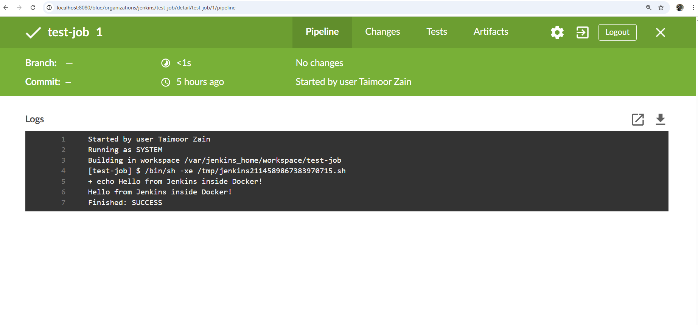

# 🚀 Project 5 – Jenkins + Docker CI/CD Pipeline

This project demonstrates a **basic CI/CD pipeline** using **Jenkins**, **Docker**, and **GitHub Webhooks**.

On every push to GitHub, Jenkins automatically pulls the code and runs a shell script that builds a Docker image using the provided Dockerfile. This simulates real-world continuous integration and delivery (CI/CD).

---

## 🔧 Tech Stack

- Jenkins (containerized via Docker Desktop; also tested on EC2 for AWS familiarity)
- Docker CE (Community Edition)
- (trigger CI/CD pipeline on push)
- Shell Scripting (Bash)
- Linux Terminal / CLI

---

## 🔄 CI/CD Workflow

1. GitHub repo is connected to Jenkins via webhook  
2. Jenkins job triggers automatically on push  
3. Jenkins pulls the latest code  
4. Executes build.sh which builds a Docker image using the Dockerfile  
5. Logs the result in Jenkins job console output

---

## 📁 Project Structure
```
jenkins-docker-ci-cd/
├── build.sh # Shell script to build Docker image
├── Dockerfile # Simple Alpine-based Dockerfile
├── .gitattributes # Enforces LF line endings (fix for Exec format error)
├── README.md  # Project overview and instructions
└── screenshot.png      # Jenkins job success proof
```
---

## 🐳 Dockerfile
```Dockerfile
## Alpine-based build script runner

FROM alpine:latest

RUN apk add --no-cache bash

COPY build.sh /app/build.sh
WORKDIR /app
RUN chmod +x build.sh

CMD ["./build.sh"]
```
---

## 🛠️ Shell Script (build.sh)
```
bash
#!/bin/bash
docker build -t my-jenkins-image .
```
---
## ✅ Jenkins Job Output

The following screenshot shows a successful Jenkins job execution after pushing to GitHub:



---

## 📬 GitHub Webhook Setup

To enable auto-triggering of Jenkins jobs on every push to GitHub:

1. Go to your GitHub repo → **Settings** → **Webhooks**
2. Click **"Add webhook"**
3. Fill in the following:
   - **Payload URL**: http://<your-ec2-ip>:8080/github-webhook/
   - **Content type**: application/json
   - **Trigger**: Just the **push** event
4. Click **"Add webhook"**

This ensures Jenkins gets notified instantly whenever you push changes to your repository.

---
## 🙋 Author  
**Taimoor**  
Cloud & DevOps Engineer  
GitHub: [@taimoordevops](https://github.com/taimoordevops)

---

## 📎 Repo Link  
🔗 [View on GitHub](https://github.com/taimoordevops/jenkins-docker-ci-cd)
---

### 📌 Notes & Fixes

Resolved Exec format error in build.sh by:

- Adding .gitattributes to force **LF** line endings for shell scripts
- Running dos2unix build.sh on the EC2 instance
- Setting executable permission via chmod +x build.sh

Jenkins job configuration:

- ✅ **GitHub project**: Enabled with repository URL
- ✅ **Build Triggers**: GitHub webhook
- ✅ **Build Step**: Execute shell with ./build.sh
thats final. save commit chnages? (using web ui)
